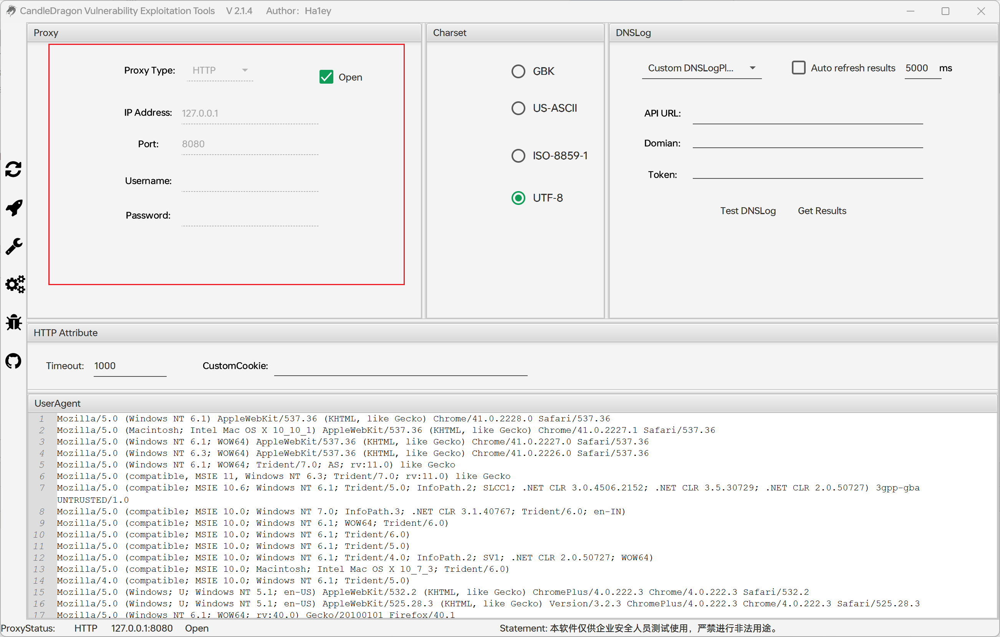

# CandleDragon

## 运行&打包

JDK 1.8 

打包命令：mvn package

## 插件页面

左边会初始化显示所有的插件名字，可以根据列表上方的输入框根据：`插件名字`  `插件作者`  `CNVD/CVE编号` `漏洞厂商` `漏洞名字`  `披露时间` 关键字进行筛选。

鼠标放置某个插件上面会以悬浮框的形式显示插件的信息


批量选中多个插件右键可以发送到`POC`页面进行扫描，批量选中不可选择发送到EXP，必须单个选中。


POC可以批量扫描多个插件和多个URL，扫描结果会输出在右边的表格和下发的结果输出区域。


选中EXP后，如果该插件编写了EXP可以跳转到漏洞利用的界面，根据插件定义好的参数进行输入


最后会将输出结果打印到软件结果输出区域


## 设置页面

### 自定义代理功能

可设置`HTTP`代理和`Socks`代理方便各种网络环境使用，开启代理功能后软件左下角会有代理开启提示，同时原代理参数不可标记，可以关闭后修改参数重新启动。




### 自定义编码方式

默认使用`UTF-8`编码，可根据目标站点自行设置，插件中使用`Targetinfo#getCharset()`方法获取软件设置的自定义编码


### 自定义超时时间

自定义Http超时时间，默认`1000`毫秒，插件中使用`TargetInfo#getTimeout()`方法获取软件设置的自定义超时时间


### 自定义User-Agent

自定义User-Agent头，默认使用这些随机的User-Agent头，插件中使用`TargetInfo#getUserAgent()`方法获取软件设置的自定义UserAgent头


### DNSLog

可以配合Poc插件定制需要DNSLog的场景。


DNSLog的结果在这里显示


## 插件编写

### 目录结构


主要分为`插件注册接口实现类`   `插件信息类`   `插件POC`		`插件EXP`


### 插件注册接口实现类

类名必须为PluginRegister，并实现`PluginManager`接口，需要在下面一次调用`doRegister`方法传入自己定义好的插件信息类对象。

例：

```java
public class PluginRegister implements PluginManager {
    @Override
    public void registerPlugin(Register register) {
        register.doRegister(new PluginDemo());      //有几个插件就注册几个以此类推
//        register.doRegister(new PluginDemo1());
//        register.doRegister(new PluginDemo2());
    }
}
```


#### 插件信息

类名任意，但必须实现`IPlugin`接口，通过调用`PluginInfo`对象的多个方法自定义插件的信息，还需要关联这个插件对应的POC和多个EXP。

例：

```java
public class PluginDemo implements IPlugin {
    @Override
    public void setPluginInfo(PluginInfo pluginInfo) {

        pluginInfo.setPluginName("插件名字");
        pluginInfo.setPluginAuthor("插件作者名");
        pluginInfo.setVulName("漏洞名");
        pluginInfo.setVulId("漏洞CNVD/cve");
        pluginInfo.setDescription("描述");
        pluginInfo.setVulCategory("漏洞类型");
        pluginInfo.setVulProduct("厂商");
        pluginInfo.setPluginVersion("插件版本");
        pluginInfo.setVulDisclosureTime("披露时间");
        pluginInfo.setVulScope("漏洞适应版本");

        List<Exploit> exploits = new ArrayList<>();     //新建一个用来存放exp的list,如果没有编写EXP可以不用创建EXP列表
        exploits.add(new EXPDEMO());        //有几个exp就添加几个
//        exploits.add(new EXPDEMO1());
//        exploits.add(new EXPDEMO2());


        pluginInfo.addPoc(new POCDEMO());   //添加这个插件的检测POC

        pluginInfo.addExploit(exploits);    //最后将所有的exp列表添加到插件信息，如果没有写EXP可以不用调用此方法
    }
}
```


#### POC

类名任意，但必须实现`Poc`接口，通过`TargetInfo`对象获取程序前端自定义的参数，通过`Result`对象将想要输出的信息打印到程序前端显示。

例：

```java
public class POCDEMO implements Poc {
    @Override
    public void doPoc(TargetInfo targetInfo, Result result) {
        targetInfo.getAddress();    //获取前端输入的URL地址
        targetInfo.getCharset();    //获取获取字符编码
        targetInfo.getTimeout();    //获取自定义超时时间
        targetInfo.getUserAgent();  //获取自定义UA头，默认随机


        result.setPocVul(true);     //是否存在漏洞，最后会在扫描结果的表格中显示
        result.setPocVul(false);    
        result.setPocMsg("Poc message");    //Poc扫描结果表格中显示的提示信息
        
        
        result.printFail("");   //打印失败信息
        result.printInfo("");   //打印普通信息
        result.printRaw("");    //打印原始信息
        result.printSuccess("");    //打印成功信息
        result.printError(new Throwable());  //打印 try catch的异常信息

    }

}
```


#### EXP

类名任意，但必须实现`Exploit`接口，`setExploitTitle()`方法定义程序漏洞利用的标题


通过`HelpPlugin`对象的`createArgs`方法创建一个参数对象，最后将多个参数添加到一个List中并返回。

最后`doExploit`中的`argsmap`参数可以通过`argsmap.get("参数名字")`获取上面自定义参数的输入值。

例：

```java
public class EXPDEMO implements Exploit {
    @Override
    public String initInfo() {
        return "该漏洞需要初始化的信息";
    }

    @Override
    public String setExploitTitle() {
        return "xxx插件xxx利用方式";
    }

    @Override
    public List<ArgsInfo> setArgs(HelpPlugin helpPlugin) {
        List<ArgsInfo> argsList = new ArrayList<>();
        ArgsInfo args1 = helpPlugin.createArgs();
        args1.setArgsName("参数名字");
        args1.setDescription("参数描述");
        args1.setDefaultValue("参数默认值");

        ArgsInfo args2 = helpPlugin.createArgs();
        args2.setArgsName("参数名字2");
        args2.setDescription("参数描述2");
        args2.setDefaultValue("参数默认值2");

        argsList.add(args1);
        argsList.add(args2);

        return argsList;
    }


    @Override
    public void doExploit(TargetInfo targetInfo, Map<String, Object> argsmap, Result result) {
        targetInfo.getAddress();    //获取前端输入的URL地址
        targetInfo.getCharset();    //获取获取字符编码
        targetInfo.getTimeout();    //获取自定义超时时间
        targetInfo.getUserAgent();  //获取自定义UA头，默认随机

        argsmap.get("参数名字");    //获取上面自定义的参数名的value
        result.printFail("");   //打印失败信息
        result.printInfo("");   //打印普通信息
        result.printRaw("");    //打印原始信息
        result.printSuccess("");    //打印成功信息
        result.printError(new Throwable());  //打印 try catch的异常信息

    }
}
```


## 感谢
感谢 @V1rtu0l

感谢@c0ny1师傅的woodpecker项目https://github.com/woodpecker-framework
